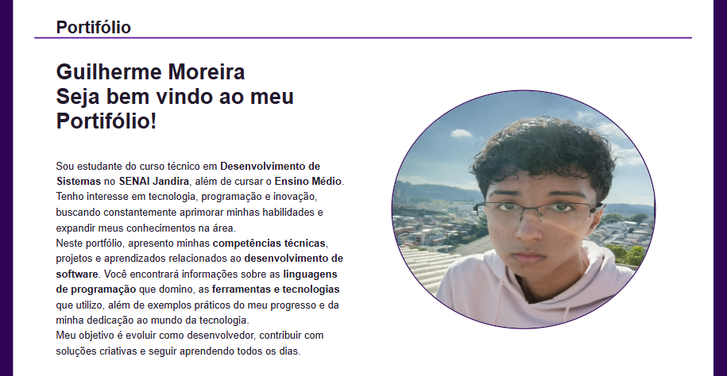

# Portfólio

Bem-vindo ao repositório do meu **portfólio pessoal**!  
Este projeto foi desenvolvido para apresentar minhas **habilidades**, **formação** e **projetos** de forma organizada e moderna.  
O foco está em **simplicidade**, **performance** e **design limpo**, servindo como uma vitrine do meu crescimento na área de desenvolvimento.

---

## Preview

---

## Seções do site

O site é dividido em partes que facilitam a navegação:

- **Apresentação** — Uma breve introdução sobre mim e meus objetivos profissionais.  
- **Habilidades** — Tecnologias, ferramentas e conhecimentos que domino.  
- **Projetos** — Trabalhos, experimentos e sistemas que desenvolvi.  
- **Formação** — Cursos, certificados e instituições que fazem parte da minha trajetória.  
- **Entre em contato** — Formulário e links para minhas redes sociais e formas de contato.

---

## Organização do repositório

Este repositório utiliza os recursos do GitHub para manter tudo bem estruturado:

- **Wiki** — Documentação detalhada sobre o projeto, ideias futuras e anotações técnicas.  
- **Projects** — Organização das **issues** em quadros (Kanban) para acompanhar o progresso.  
- **Issues** — Registro de funcionalidades planejadas e pendentes.

---

## Tecnologias utilizadas

As principais tecnologias e ferramentas usadas neste projeto são:

- **HTML5**  
- **CSS3**  

---

## Autor
[Guilherme Moreira](https://www.linkedin.com/in/guilherme-moreira-08a8b8348/)